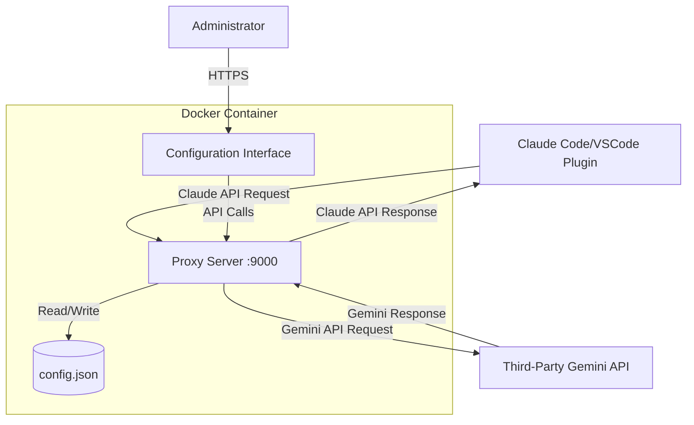

# Design Document

## Overview

Gemini-Claude is a lightweight API proxy service built with Node.js that translates between Anthropic Claude API format and third-party Gemini API format. The system consists of two main components: a proxy server that handles API request/response conversion, and a web-based configuration interface for managing settings. The entire application runs in a Docker container and uses a JSON file for persistent configuration storage.

## Architecture

### System Architecture



### Technology Stack

- **Runtime**: Node.js 20+
- **Web Framework**: Express.js for HTTP server
- **Frontend**: Vanilla HTML/CSS/JavaScript (no framework dependencies)
- **Storage**: JSON file-based configuration
- **Container**: Docker with Alpine Linux base image
- **Port**: 9000 (exposed)

### Directory Structure

```
gemini-claude-proxy/
├── src/
│   ├── server.js              # Main Express server
│   ├── proxy.js               # API conversion logic
│   ├── auth.js                # Authentication middleware
│   ├── config.js              # Configuration management
│   └── public/
│       ├── index.html         # Configuration UI
│       ├── styles.css         # Styling with theme support
│       └── app.js             # Frontend logic
├── data/
│   └── config.json            # Persistent configuration (volume mount)
├── Dockerfile
├── package.json
└── README.md
```

## Components and Interfaces

### 1. Proxy Server (server.js)

**Responsibilities:**
- Initialize Express application
- Serve static configuration UI
- Route API requests to appropriate handlers
- Handle CORS for cross-origin requests

**Endpoints:**

| Method | Path | Description | Auth Required |
|--------|------|-------------|---------------|
| POST | /v1/messages | Claude API proxy endpoint | Local API Key |
| POST | /api/login | Authenticate admin user | None |
| GET | /api/config | Get current configuration | Session |
| POST | /api/config | Update configuration | Session |
| POST | /api/test-connection | Test Gemini API connectivity | Session |
| POST | /api/generate-key | Generate new local API key | Session |
| POST | /api/change-password | Change admin password | Session |
| GET | / | Serve configuration UI | None |

### 2. API Conversion Module (proxy.js)

**Responsibilities:**
- Convert Claude API requests to Gemini format
- Convert Gemini responses to Claude format
- Handle both streaming and non-streaming responses
- Forward requests to configured Gemini API endpoint

**Key Functions:**

```javascript
// Convert Claude request to Gemini format
function claudeToGeminiRequest(claudeRequest) {
  // Extract system instruction
  // Convert messages array
  // Map parameters (max_tokens, temperature, etc.)
  // Return Gemini-formatted request
}

// Convert Gemini response to Claude format
function geminiToClaudeResponse(geminiResponse, messageId) {
  // Extract content from candidates
  // Map finish reason
  // Format usage metadata
  // Return Claude-formatted response
}

// Handle streaming conversion
function streamGeminiToClaude(geminiStream, messageId) {
  // Parse SSE events from Gemini
  // Convert to Claude SSE format
  // Emit message_start, content_block_delta, message_stop events
}

// Build Gemini API endpoint URL
function buildGeminiUrl(config, stream) {
  // Construct URL: {geminiApiUrl}/models/{geminiModelName}:generateContent
  // Add ?alt=sse for streaming requests
  // Return complete endpoint URL
}
```

**Conversion Mappings:**

Claude → Gemini:
- `messages` → `contents` (role: "assistant" → "model", "user" → "user")
- `system` → `system_instruction`
- `max_tokens` → `generationConfig.maxOutputTokens`
- `temperature` → `generationConfig.temperature`
- `top_p` → `generationConfig.topP`
- `top_k` → `generationConfig.topK`
- `stop_sequences` → `generationConfig.stopSequences`

Gemini → Claude:
- `candidates[0].content.parts` → `content` array
- `finishReason` → `stop_reason` (STOP → end_turn, MAX_TOKENS → max_tokens)
- `usageMetadata` → `usage` (promptTokenCount → input_tokens, candidatesTokenCount → output_tokens)

### 3. Authentication Module (auth.js)

**Responsibilities:**
- Validate admin password for configuration access
- Manage session tokens
- Validate local API keys for proxy requests

**Session Management:**
- Use in-memory session store with 1-hour expiration
- Generate cryptographically secure session tokens
- Clear session on logout or password change

**API Key Validation:**
- Extract Bearer token from Authorization header
- Compare against stored local API key
- Return 401 if invalid or missing

### 4. Configuration Manager (config.js)

**Responsibilities:**
- Load configuration from JSON file
- Save configuration changes atomically
- Provide default values for missing settings
- Validate configuration values

**Configuration Schema:**

```json
{
  "adminPassword": "hashed_password",
  "geminiApiUrl": "https://example.com/v1beta",
  "geminiApiKey": "encrypted_key",
  "geminiModelName": "gemini-1.5-pro-latest",
  "localApiKey": "generated_key",
  "version": "1.0.0"
}
```

**Default Values:**
- `adminPassword`: Hash of "ADMIN_PASSWORD" environment variable or "admin123"
- `geminiApiUrl`: "GEMINI_API_URL" environment variable or empty string
- `geminiApiKey`: "GEMINI_API_KEY" environment variable or empty string
- `geminiModelName`: "GEMINI_MODEL_NAME" environment variable or "gemini-1.5-pro-latest"
- `localApiKey`: Auto-generated 32-character random string

### 5. Configuration UI (public/)

**Responsibilities:**
- Provide login interface
- Display and edit configuration settings
- Show connectivity status
- Handle theme switching

**UI Components:**

1. **Login Card**
   - Password input field
   - Login button
   - Error message display

2. **Configuration Card** (shown after authentication)
   - Theme toggle (sun/moon icon)
   - Connectivity indicator (colored dot)
   - Gemini API URL input
   - Gemini API Key input (password field)
   - Gemini Model Name input (text field)
   - Local API Key display (read-only with copy button)
   - Generate Key button
   - Change Password section (collapsible)
   - Save button
   - Logout button

**Theme Implementation:**
- CSS variables for colors
- Light theme: `--bg-color: #e8e8e8`, `--card-bg: #ffffff`, `--text-color: #212121`
- Dark theme: `--bg-color: #212121`, `--card-bg: #2a2a2a`, `--text-color: #e8e8e8`
- Store preference in localStorage
- Apply theme class to body element

**Card Styling:**
```css
.card {
  width: 500px;
  max-width: 90vw;
  padding: 40px;
  border-radius: 30px;
  background: var(--card-bg);
  box-shadow: 15px 15px 30px rgba(0,0,0,0.2),
              -15px -15px 30px rgba(255,255,255,0.1);
}
```

## Data Models

### Configuration Object

```typescript
interface Config {
  adminPassword: string;      // bcrypt hashed password
  geminiApiUrl: string;        // Third-party Gemini API base URL
  geminiApiKey: string;        // API key for Gemini service
  geminiModelName: string;     // Gemini model name (e.g., "gemini-1.5-pro-latest")
  localApiKey: string;         // Generated key for downstream clients
  version: string;             // Config schema version
}
```

### Session Object

```typescript
interface Session {
  token: string;               // Random session identifier
  createdAt: number;           // Timestamp
  expiresAt: number;           // Timestamp (createdAt + 1 hour)
}
```

### API Request/Response Models

**Claude API Request:**
```typescript
interface ClaudeRequest {
  model: string;
  messages: Array<{
    role: "user" | "assistant";
    content: string | Array<ContentBlock>;
  }>;
  system?: string;
  max_tokens: number;
  temperature?: number;
  top_p?: number;
  top_k?: number;
  stop_sequences?: string[];
  stream?: boolean;
}
```

**Gemini API Request:**
```typescript
interface GeminiRequest {
  contents: Array<{
    role: "user" | "model";
    parts: Array<{ text: string }>;
  }>;
  system_instruction?: {
    parts: Array<{ text: string }>;
  };
  generationConfig?: {
    maxOutputTokens?: number;
    temperature?: number;
    topP?: number;
    topK?: number;
    stopSequences?: string[];
  };
  safetySettings: Array<{
    category: string;
    threshold: string;
  }>;
}
```

## Error Handling

### Error Categories

1. **Authentication Errors (401)**
   - Invalid admin password
   - Invalid or missing local API key
   - Expired session token

2. **Validation Errors (400)**
   - Invalid URL format
   - Missing required fields
   - Invalid request body

3. **Upstream API Errors (502)**
   - Gemini API connection failure
   - Gemini API returns error response
   - Timeout waiting for response

4. **Server Errors (500)**
   - Configuration file read/write failure
   - Unexpected exceptions

### Error Response Format

```json
{
  "error": {
    "type": "authentication_error",
    "message": "Invalid API key"
  }
}
```

### Error Handling Strategy

- Log all errors with timestamp and context
- Return appropriate HTTP status codes
- Provide user-friendly error messages
- Never expose sensitive information in errors
- Implement retry logic for transient upstream failures (max 2 retries)

## Testing Strategy

### Unit Tests

1. **Configuration Manager**
   - Test loading configuration from file
   - Test saving configuration atomically
   - Test default value handling
   - Test validation logic

2. **API Conversion**
   - Test Claude → Gemini request conversion
   - Test Gemini → Claude response conversion
   - Test streaming conversion
   - Test edge cases (empty messages, missing fields)

3. **Authentication**
   - Test password hashing and verification
   - Test session creation and validation
   - Test API key validation
   - Test session expiration

### Integration Tests

1. **Proxy Flow**
   - Send Claude API request through proxy
   - Verify Gemini API receives correct format
   - Verify response is converted back correctly
   - Test streaming responses end-to-end

2. **Configuration API**
   - Test login flow
   - Test configuration update
   - Test connectivity test
   - Test API key generation

### Manual Testing

1. **Docker Deployment**
   - Build and run container
   - Verify port 9000 is accessible
   - Test volume persistence across restarts
   - Verify environment variables are applied

2. **UI Testing**
   - Test login with correct/incorrect password
   - Test theme switching
   - Test configuration save
   - Test connectivity indicator
   - Test responsive design on different screen sizes

3. **Client Integration**
   - Configure Claude Code with proxy endpoint
   - Send test requests
   - Verify responses are correct
   - Test streaming in real application

## Security Considerations

1. **Password Security**
   - Use bcrypt for password hashing (cost factor 10)
   - Never log or expose passwords
   - Require password change on first login (optional enhancement)

2. **API Key Security**
   - Generate cryptographically secure random keys (32 bytes)
   - Store Gemini API key encrypted at rest (optional enhancement)
   - Never log API keys
   - Validate all API keys before processing requests

3. **Session Security**
   - Use cryptographically secure random session tokens
   - Implement 1-hour session timeout
   - Clear sessions on logout
   - Invalidate all sessions on password change

4. **Input Validation**
   - Validate all user inputs
   - Sanitize URL inputs
   - Limit request body size (10MB max)
   - Implement rate limiting (optional enhancement)

5. **CORS Configuration**
   - Allow all origins for proxy endpoint (required for Claude clients)
   - Restrict configuration API to same-origin only

## Performance Considerations

1. **Streaming Optimization**
   - Use Node.js streams for efficient memory usage
   - Avoid buffering entire responses
   - Implement backpressure handling

2. **Configuration Caching**
   - Cache configuration in memory
   - Only reload from disk on startup or explicit update
   - Use file watching for hot reload (optional)

3. **Connection Pooling**
   - Reuse HTTP connections to Gemini API
   - Set appropriate keep-alive timeouts
   - Limit concurrent connections

4. **Resource Limits**
   - Set memory limit in Docker (512MB recommended)
   - Implement request timeout (60 seconds)
   - Limit concurrent requests (100 max)

## Deployment

### Docker Configuration

**Dockerfile:**
- Use `node:20-alpine` base image
- Install only production dependencies
- Run as non-root user
- Expose port 9000
- Set working directory to /app
- Volume mount /app/data for persistence

**Environment Variables:**
- `ADMIN_PASSWORD`: Initial admin password (default: "admin123")
- `GEMINI_API_URL`: Initial Gemini API URL (optional)
- `GEMINI_API_KEY`: Initial Gemini API key (optional)
- `GEMINI_MODEL_NAME`: Initial Gemini model name (default: "gemini-1.5-pro-latest")
- `NODE_ENV`: Set to "production"

**Docker Compose Example:**
```yaml
version: '3.8'
services:
  gemini-claude-proxy:
    build: .
    ports:
      - "9000:9000"
    volumes:
      - ./data:/app/data
    environment:
      - ADMIN_PASSWORD=${ADMIN_PASSWORD}
      - GEMINI_API_URL=${GEMINI_API_URL}
      - GEMINI_API_KEY=${GEMINI_API_KEY}
      - GEMINI_MODEL_NAME=${GEMINI_MODEL_NAME}
    restart: unless-stopped
```

### Configuration for Claude Clients

**Claude Code / VSCode Plugin:**
1. Open settings
2. Set API endpoint to `http://localhost:9000`
3. Set API key to the generated local API key from configuration UI
4. Select model (any Claude model name will work, proxy will use configured Gemini model)

## Future Enhancements

1. **Multi-User Support**: Allow multiple admin users with different permissions
2. **API Key Rotation**: Automatic rotation of local API keys
3. **Usage Analytics**: Track request counts, token usage, and costs
4. **Model Selection**: Allow configuration of specific Gemini models
5. **Request Logging**: Optional logging of requests/responses for debugging
6. **Health Check Endpoint**: `/health` endpoint for monitoring
7. **Metrics Export**: Prometheus-compatible metrics endpoint
8. **HTTPS Support**: Built-in TLS termination
9. **Backup/Restore**: Configuration backup and restore functionality
10. **API Key Encryption**: Encrypt sensitive values in config.json
